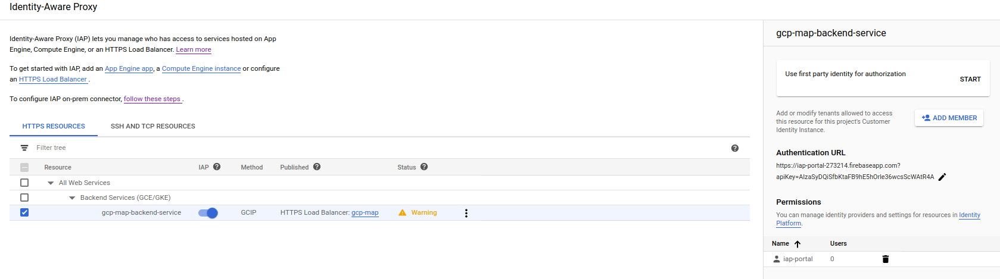

## IAP access to GCP and On-prem systems using Identity Platform

As more employees work from home, it is important to provide more options for them to securely access internal services and sites.

These sites maybe your intranet portal, sensitive HR or financial systems that are not exposed directly externally.  Traditionally, companies accessed these sites after establishing a VPN tunnel from an employees laptop directly to the corporate network.  Just about any administrator of such system will tell you VPNs are quite cumbersome to maintain and essentially provide security based dynamically expanding the trusted network.

At Google, we found the access model based primarily on a network perimeter did not sufficiently scale with a mobile workforce nor provide sufficient selective security guarantees for sensitive applications.  Our approach was to assess the _context_ of a given request for an application holistically.  By that we would take signals derived from multiple sources at runtime to evaluate the integrity of a call with the resource being accessed.  For example, the evaluation signals for a request would include who is making the call, from what device, from what network, at what time, and so on.  A request is not simply evaluated using administrator define static `if-then` chain but also assigned trust levels based on heuristics inferred from prior contexts.

This internal system is we used to achieve is described in [BeyondCorp](https://cloud.google.com/beyondcorp#researchPapers) research paper which goes into more details about these signals.  For external users, the same system is [Google Cloud Identity Aware Proxy](https://cloud.google.com/iap) (`IAP`).

In the current context of remote work, the benefits of non-VPN, context based access is apparent. However, the question of how your users are identified to IAP in the first place still needs to be addressed. Until recently, any user that wanted to participate in IAP had to be either a GSuties user or imported into and configured for [Cloud Identity](https://cloud.google.com/identity).  GCP customers use Cloud Identity to directly access resources such as Cloud Storage or PubSub and participate in the IAM controls GCP offers.  In other words, its primarily there to enable your users _use_  GSuites and Google Cloud resources.

What if your company just wanted to use IAP with an identity provider of your choosing without having to import and use Cloud Identity?  [Google Cloud Identity Platform](https://cloud.google.com/identity-platform) is a general customer identity and access management (CIAM) system which is now [supported by IAP](https://cloud.google.com/iap/docs/external-identities). With Identity Platform, you define the actual root identity provider for your users ([SAML](https://cloud.google.com/identity-platform/docs/how-to-enable-application-for-saml), ADFS, [OIDC](https://cloud.google.com/identity-platform/docs/how-to-enable-application-for-oidc), Okta, Auth0, Yahoo, Google, etc) and when used in conjunction with IAP, you can provide VPN-less access to your system while retaining the same control over your provider.

The usecase for using Identity Platform here is best illustrated with some examples:

* You use Active Directory but not wish to subscribe to and manage the [synchronization your users with Cloud Identity](https://cloud.google.com/blog/products/identity-security/using-your-existing-identity-management-system-with-google-cloud-platform).  In this case, you would use [Identity Platform SAML integration](https://cloud.google.com/identity-platform/docs/how-to-enable-application-for-saml) to federate with Active Directory.  If a user attempts to access an IAP protected resource, he/she will get ultimately get redirected to your SAML ADFS login screen.  Post login, the users context with IAP is established and a decision to grant access to the resource is made.  

* You use Gsuites but do not want your users IAM access to GCP resources.  Here you can configure Identity Platform with an OpenIDConnect provider which happens to be Google.  A user accessing a protected resource is redirected ultimately to a Google Login screen for Gsuites (which itself maybe SAML).  Once authenticate, the users context for the backend system is set.

* You already use an identity provider like Okta or Auth0 but want to use IAP.  Here you can use Identity Platform [OpenID Connect](https://cloud.google.com/identity-platform/docs/how-to-enable-application-for-oidc) capability to federate with your root identity provider. A user accessing a resource will ultimately see Okta or Auth0 screen.  After login, the users context with IAP is established through Identity Platform.

The sample usecases above demonstrate how to establish a users identity.  With that identity in context, IAP has several integrations which you can use to give access to onprem systems:

* Establish VPN connectivity once from a GCP project to your on-prem system.  Once the connectivity is established, you can deploy the [IAP Connector](https://cloud.google.com/iap/docs/enabling-on-prem-howto) on GCP which treats your backend application as a protected resource.  You then expose the connector's interface externally. Your users would authenticate with whatever mechanism IAP is configured to use (which in this case is whatever Identity Platform).  Once authenticated, the request is securely tunneled to your backend system.

* Your application is already exposed externally but you want to protect it with IAP.  In this case, you configure GCP to treat your application as an [Internet network endpoint group](https://cloud.google.com/load-balancing/docs/negs/internet-neg-concepts).  This will route traffic through an IAP protected loadbalncer to your backend.  Your service must validate the secure headers sent by IAP.  As an example of how Google uses this mode, consider the fact that most internal applications are actually DNS resolveable everywhere but access is proxied:
  ```bash
  $ nslookup memegen.corp.google.com 8.8.8.8
  Server:		8.8.8.8
  Address:	8.8.8.8#53

  Non-authoritative answer:
  memegen.corp.google.com	canonical name = uberproxy.l.google.com.
  Name:	uberproxy.l.google.com
  Address: 209.85.232.129
  Name:	uberproxy.l.google.com
  Address: 2607:f8b0:400d:c0d::81

  $ curl -v https://memegen.corp.google.com/
  > GET / HTTP/2
  > Host: memegen.corp.google.com
  > 
  < HTTP/2 302 
  < location: https://login.corp.google.com/request?s=memegen.corp.google.com:443/uberproxy/&d=https://memegen.corp.google.com/%3Fupxsrf%3DAO9zFu3IK0f_6C-DLUZ6GxreooIS0ir5dDM4FbnCwfPVqNfBog:1586098940127&maxAge=1200&authLevel=1500&keyIds=zRI,s8x
  ```

The tutorials below focus on creating a 'hello world' integration of IAP and Identity Platform using the scenarios above.

Once you begin to use IAP with Identity Platform (or Cloud Identity), you can further tune the context signals and security posture by enabling and using these additional features:

* [Identity Platform with Multi Factor Authentication](https://cloud.google.com/identity-platform/docs/web/mfa)
* Cloud Identity with Multi Factor and GCP Session Control
* [Context Aware Access](https://cloud.google.com/context-aware-access/docs/overview)
* [Audit Logging](https://cloud.google.com/identity-platform/docs/how-to-audit-logging)
* [Blocking Functions]()
    --> https://cloud.google.com/identity-platform/docs/how-to-extend-authentication-functions

---

This article describes how you can use `IAP` and `Identity Platform` together in several modes to identify a user and then access your internal system.


* Users Authentication:

  Your users will authenticate with a sample portal page that simply takes username/password. 
  (this is just for demonstration; you can define your any provider Identity Platform supports (SAML, ActiveDirectory, OpenIDConnect, Yahoo, etc)


* Access Backend Service

  - A) GCE VM

      In this mode, you will deploy an VM into GCP that will run `nginx`.
      The intent for this mode is to show the default configuration where you can control access to a service running on GCP.

      In this flow, the request proceeds as:
      `user -> IAP -> GCE backend`

  - B) Internal VM running "on-prem"

      You will setup two projects:  one to host IAP and another that represents your 'onprem' network which you will connect using a VPN tunnel.

      The onprem system will not be exposed externally will run an `apache` webserver that will represent your intranet site.
      IAP project will establish a secure connection on the backend to the simulated 'on-prem' network using low level `ipsec` VPN as well as [Cloud VPN](https://cloud.google.com/vpn/docs/concepts/overview)

      This is setup is more complex to setup since this involves establishing a secure backend connection via VPN

      In this flow, the request proceeds as:
      `user -> IAP -> IAP Connector -> VPN --> backend`

  - C) External VM running "on-prem" 
    
      In this mode, you will run a VM "on-prem" that is exposed externally but one that validates requests authorized by IAP.
      This mode is for the situation where you would like to use IAP but cannot modify the underlying code to [perform IAP's user validation](https://cloud.google.com/iap/docs/identity-howto).

      For this, you will run a simple [Envoy](https://www.envoyproxy.io/) on prem that will validate IAPs headers only.
      Once validated, the request is allowed to proceed to the backend system.

      In this flow, the request proceeds as:
      `user -> IAP -> Internet NEG --> backend`


  

---

### Setup

  There are several stages to this tutorial depending on which aspect you are interested in.

  You must setup the Identity Platform login handler (step 1) and then elect to jump to one or more of steps 2,3 or 4.

  1. Setup Identity Platform login handler

    - Enable Cloud Identity
    - Enable Email/Password Authentication provider 
    - Deploy Login Handler page to FirebaseHosting

  2. GCE Backend

    - Setup GCP-internal backend service
    - Setup Google LoadBalancer L7 with SSL certificate.
    - Configure Identity Platform with 3rd party auth (username/password)
    - Deploy 3rd party login page
    - Configure IAP backend

  2. On-Prem Backend over VPN
  
    - Configure onprem-internal application
    - Configure VPN tunnel from GCP->onprem
    - Configure GCP->onprem backend service
    - Configure IAP proxy for onprem-internal backend service.

  4. On-Prem Backend over NEG
    - Configure onprem-external application
    - Configure GCP->internet NEG backend
    - Configure IAP proxy for onprem-external service


### Create Projects

  Start with creating two *new* projects.   You can use an existing project but it the flow below assumes you are starting from a known state.

  The projects we will be using below are:

  - GCP: ProjectID: 

    `export GCP_PROJECT=iap-portal-273214`

  - On-Prem: 

    `export ONPREM_PROJECT=onprem-273214`


### 1. Setup Identity Platform login handler

  Ths step sets up a simple login page for Identity Platform which you will configure for `Email/Password` login provider.

  You must have `git` and `nodejs/npm` installed on your laptop.

  1. Enable [Identity Platform](https://console.cloud.google.com/marketplace/details/google-cloud-platform/customer-identity) for `$GCP_PROJECT`

  3. `Add Provider` -> `Email/Password` 
      Select "enabled"; 
      Uncheck "Allow Password-less Login"

      


  4. Deploy Firebase Hosted Login Screen

      ```bash
      git clone https://github.com/GoogleCloudPlatform/iap-gcip-web-toolkit.git
      cd iap-gcip-web-toolkit/sample/app
      npm install

      cd  ..//authui-firebaseui
      npm install
      ```

  5. Edit `firebaseui/src/script.ts`:

    Set to use the `Email/Password` provider only

  ```ts
      const tenantsConfig = {
        // Project level IdPs flow.
        '*': {
          displayName: 'My Organization',
          signInOptions: [
            firebase.auth.EmailAuthProvider.PROVIDER_ID,
          ],
          // Do not trigger immediate redirect in Safari without some user
          // interaction.
          immediateFederatedRedirect: !isSafari(),
        },
      };
  ```

  6.  Deploy firebase hosted login screen

  ```bash
    cd iap-gcip-web-toolkit/sample/authui-firebaseui
    firebase use --add
      (select the $GCP_PROJECT)
    npm run deploy
  ```

  Note the URL that was deployed:

  ```bash
    https://iap-portal-273214.firebaseapp.com
  ```
    [your url will be different (`https://$GCP_PROJECT.firebaseapp.com`)]

  This URL is where IAP should redirect to that will simulate your login page handler.  If you configure Identity Platform for any number of other providers such as SAML, OIDC, Yahoo, Google login, this page would handle that for you.  Advanced users can customize the login handler substantially.  This tutorial uses the starter SDK for Identity Platform.


### Set Environment Variables

This tutorial uses several environment variables which we will use later.

For now, any shell where you execute a command, ensure these are set.

  ```bash
  export GCP_PROJECT=iap-portal-273214
  export GCP_ZONE=us-central1-a
  export GCP_REGION=${GCP_ZONE%-[a-z]}
  export GCP_VPC=default
  export GCP_VPC_SUBNET=default
  export GCP_VPC_SUBNET_CIDR=`gcloud compute networks subnets describe $GCP_VPC  --region=$GCP_REGION  --format="value(ipCidrRange)" --project $GCP_PROJECT`
  export GCP_TEST_INSTANCE=instance-test-gcp

  export ONPREM_PROJECT=onprem-273214
  export ONPREM_ZONE=us-central1-a
  export ONPREM_REGION=${ONPREM_ZONE%-[a-z]}
  export ONPREM_VPC=my-on-prem-network
  export ONPREM_SUBNET=my-on-prem-subnet
  export ONPREM_SUBNET_CIDR=192.168.0.0/20
  export ONPREM_INSTANCE_VPN_GATEWAY=instance-vpn-gateway-on-prem
  ```


### 2. GCP Backend

  This is the baseline configuration that demonstrates how to use IAP-Identity Platform with a VM running in GCE alone.  This section will use a plain `nginx` webserver to simulate the protected backend application.

#### Enable Services on the GCP Project

  ```bash
    gcloud config set project $GCP_PROJECT

    gcloud services enable  \
      compute.googleapis.com deploymentmanager.googleapis.com \
      firebase.googleapis.com iap.googleapis.com \
      container.googleapis.com \
      identitytoolkit.googleapis.com dns.googleapis.com \
      --project=$GCP_PROJECT
  ```

#### Create NAT

The GCP Backend VM will run `nginx` and will *NOT* have external connectivity.

This setp sets up a [NAT Gateway](https://cloud.google.com/nat/docs/overview) that will allow pulling the `nginx` docker image

  ```bash
  gcloud compute routers create nat-router \
      --network $GCP_VPC \
      --region $GCP_REGION

  gcloud compute routers nats create nat-config \
      --router=nat-router \
      --auto-allocate-nat-external-ips \
      --nat-all-subnet-ip-ranges \
      --enable-logging --region=$GCP_REGION
  ```

#### Create VM

The following steps starts a VM and runs `nginx` in a [Container Optimized OS](https://cloud.google.com/container-optimized-os)

  ```bash
  gcloud compute instances create-with-container nginx-vm \
    --container-image nginx:latest \
    --no-address \
    --no-service-account \
    --no-scopes \
    --zone=$GCP_ZONE --project=$GCP_PROJECT
  ```

-- If you want SSH access to this, [connect using a browser](https://cloud.google.com/compute/docs/ssh-in-browser) would be the easiest.

#### Create Instance Group and add VM

  ```bash
  gcloud compute instance-groups unmanaged create gcp-uig --zone=$GCP_ZONE --project=$GCP_PROJECT

  gcloud compute instance-groups unmanaged add-instances gcp-uig \
      --zone=$GCP_ZONE  --project=$GCP_PROJECT \
      --instances=nginx-vm
      
  gcloud compute instance-groups unmanaged set-named-ports gcp-uig \
      --zone=$GCP_ZONE  --project=$GCP_PROJECT \
      --named-ports=http:80
  ```


#### Create LoadBalancer

  - Get an External IP

    ```bash
    gcloud compute addresses create iap-ip --global  --project=$GCP_PROJECT 

    export ADDRESS=`gcloud compute addresses describe iap-ip --global --format="value(address)" --project=$GCP_PROJECT`

    $ echo $ADDRESS
    34.102.186.134
    ```

  - Edit `/etc/hosts` 
    This tutorial assumes you do not have a DNS server to point addressed towards.  As a workaround, we will just alter the local system
    resolver to test with. Add the following entry to `/etc/hosts`

    ```
    34.102.186.134 server.domain.com
    ```

  - Create VIP

    ```bash
    gcloud compute addresses create gce-backend-vip --region=$GCP_REGION --purpose GCE_ENDPOINT  --project=$GCP_PROJECT --subnet=$GCP_VPC
    ```

  You should now see several entries:
    
  ```bash
    $ gcloud compute addresses list --project=$GCP_PROJECT 
    NAME                                    ADDRESS/RANGE   TYPE      PURPOSE       NETWORK  REGION       SUBNET   STATUS
    iap-ip                                  34.102.186.134  EXTERNAL                                               RESERVED
    gce-backend-vip                         10.128.0.3      INTERNAL  GCE_ENDPOINT           us-central1  default  RESERVED
    nat-auto-ip-2497236-9-1586012695508385  34.71.95.93     EXTERNAL  NAT_AUTO               us-central1           IN_USE
  ```

  - Create Firewall Rules and HealthCheck

  ```bash
    gcloud compute firewall-rules create allow-gcp-lb-http --allow=tcp:80 --source-ranges=130.211.0.0/22,35.191.0.0/16  --project=$GCP_PROJECT
    gcloud compute http-health-checks create http-basic-check --port 80  --request-path="/"  --project=$GCP_PROJECT
  ```

  - Add instance group to backend service

      ```bash
      gcloud compute backend-services create gcp-map-backend-service   --global  \
        --protocol HTTP --port-name=http --http-health-checks http-basic-check \
        --project=$GCP_PROJECT

      gcloud compute backend-services add-backend gcp-map-backend-service \
          --balancing-mode UTILIZATION \
          --max-utilization 0.8 \
          --capacity-scaler 1 \
          --instance-group gcp-uig \
          --instance-group-zone $GCP_ZONE  --project=$GCP_PROJECT --global
      ```

  - Upload SSL certificate and configure L7LB

    We will enable SSL on the L7 LoadBalancer and will *NOT* be using [Google Managed SSL Certificates](https://cloud.google.com/load-balancing/docs/ssl-certificates/google-managed-certs) as that will require DNS resolution.  In the following step, we will upload a pregenerated SSL certificate for testing only

    ```bash
    cd certs/
    gcloud compute ssl-certificates create gcp-cert --certificate server_crt.pem --private-key server_key.pem
    ```

  The certificates are signed by a self-signed CA provided in this repo.  `server_crt.pem` has CN and SNI set to`CN=server.domain.com`

  - Deploy L7 

    ```bash
    gcloud compute url-maps create gcp-map --default-service gcp-map-backend-service  --project=$GCP_PROJECT

    gcloud compute url-maps add-path-matcher gcp-map  --path-matcher-name=gcp --default-service gcp-map-backend-service --project=$GCP_PROJECT
    gcloud compute url-maps add-host-rule  gcp-map --hosts=server.domain.com --path-matcher-name=gcp --project=$GCP_PROJECT --global 
    gcloud compute url-maps remove-host-rule gcp-map --host=*

    gcloud compute target-https-proxies create gcp-lb-proxy --url-map=gcp-map --ssl-certificates=gcp-cert --global  --project=$GCP_PROJECT
    gcloud compute forwarding-rules create gcp-content-rule --address  $ADDRESS --global --target-https-proxy gcp-lb-proxy --ports 443  --project=$GCP_PROJECT
    ```
    Your configuration should look like:

    


  - Test L7 Configuration

    Wait maybe 8mins! (really), then invoke the endpoint with curl:

    ```bash
    $ curl -s -o /dev/null  --cacert CA_crt.pem  -w "%{http_code}\n"  --resolve server.domain.com:$ADDRESS https://server.domain.com/
    200
    ```

  Once you see a `200` response back, you have successfully connected to the backend system without IAP authentication.  The next step will enable IAP:

#### Configure IAP to use Identity Platform

  On `$GCP_PROJECT`, navigate to:  [https://console.cloud.google.com/security/](https://console.cloud.google.com/security/) and select `Identity Aware Proxy` 

  1. Configure Consent Screen
     Select 'External' --> Select an email -> Save
  2. Back on the IAP configuration Screen, select the backend service `gcp-map-backend-service`
     Select "Enable 3rd party auth"
     
  3. Specify the login URL.
     The login url will be the Firebase Hosted application URL you just deployed.
     `https://iap-portal-273214.firebaseapp.com`
     Leave the APIKey unspecified (it will use the default key for firebase on the project)
     On the `Permissions` section, select the projects to apply this to.  Click `Save`
  4. Enable IAP
    


Notice that in the configuration, the Authentication `Method` is **GCPIP** (Identity Platform)

#### Verify IAP-Identity Platform on GCP

  Wait another ~8mins; yes really.

  In a new window, navigate to `http://server.domain.com`
  (you remembered to set the `/etc/hosts`?)

  You should be redirected to the Identity Platform "Login" page.

  Create any username/password (since we allowed for self-signup)

  - 

  At this step, if you configured any other provider (`SAML`, `OIDC`, etc). You could auto redirect from here or directly manage the login flow using Identity Platform SDK.

  Once you create a user, you should be redirected back to to your GCE nginx server through IAP (eg `https://server.domain.com/`!

  


  Also notice that the user now exists in Identity Platform.  Navigate to `https://console.cloud.google.com/customer-identity/users`

  

  At this point, we've accessed a Backend Service through IAP that authenticated a 3rd party username/password.

  In the next step, we will add on an onprem service and access that backend in the same way.


### On-prem Backend (VPN)

  The following sequence must will setup a VPN tunnel from the IAP enabled project to your on-prem network.  Once a user authenticates via IAP, the traffic to access the site will transit though the tunnel to your service.  The steps here are relatively lengthy and must be done in precise sequence.

    - Change Context to the `onprem project`

  ```bash
        gcloud config set project $ONPREM_PROJECT
        gcloud services enable  \
          compute.googleapis.com \
          --project=$ONPREM_PROJECT    
  ```

#### Setup VPN Tunnel

  - Create Subnet for VPN

    The following will create a custom class-C subnet range `192.168.0.0/20` for the 'onprem' network.  We do this step to avoid the GCP networks address range to conflict with the onprem.

    ```bash
    gcloud compute --project=$ONPREM_PROJECT networks create $ONPREM_VPC --subnet-mode=custom

    gcloud compute --project=$ONPREM_PROJECT networks subnets create $ONPREM_SUBNET --network=$ONPREM_VPC --region=$ONPREM_REGION --range=$ONPREM_SUBNET_CIDR
    ```

  - Allow firewall traffic through VPN

    ```bash
      gcloud compute --project=$ONPREM_PROJECT firewall-rules create allow-ipsec-500 \
          --direction=INGRESS --priority=1000 --network=$ONPREM_VPC --action=ALLOW --rules=udp:500 \
          --source-ranges=0.0.0.0/0

      gcloud compute --project=$ONPREM_PROJECT firewall-rules create allow-ssh-vpn \
          --direction=INGRESS --priority=1000 --network=$ONPREM_VPC --action=ALLOW --rules=tcp:22 \
          --source-ranges=0.0.0.0/0

      gcloud compute --project=$ONPREM_PROJECT firewall-rules create allow-icmp-$ONPREM_VPC \
          --direction=INGRESS --priority=1000 --network=$ONPREM_VPC --action=ALLOW --rules=icmp \
          --source-ranges=$ONPREM_SUBNET_CIDR

      gcloud compute --project=$ONPREM_PROJECT firewall-rules create allow-443-$ONPREM_VPC \
          --direction=INGRESS --priority=1000 --network=$ONPREM_VPC --action=ALLOW --rules=tcp:443 \
          --source-ranges=$ONPREM_SUBNET_CIDR
    ```

  - Allow Routing traffic from onprem to GCP through VPN

    ```bash
      gcloud compute --project=$ONPREM_PROJECT routes create route-to-gcp \
          --network=$ONPREM_VPC --priority=1000 \
          --destination-range=$GCP_VPC_SUBNET_CIDR --next-hop-instance=$ONPREM_INSTANCE_VPN_GATEWAY \
          --next-hop-instance-zone=$ONPREM_ZONE
    ```

  - Create VPN Gateway VM and configure `ipsec`

    This VM is externally exposed and represents the VPN hardware you may run on-prem

    ```bash
      gcloud compute --project=$ONPREM_PROJECT instances create $ONPREM_INSTANCE_VPN_GATEWAY  \
          --zone=$ONPREM_ZONE --machine-type=n1-standard-1 \
          --subnet=$ONPREM_SUBNET  --can-ip-forward --no-service-account \
          --no-scopes --image-family=debian-9 --image-project debian-cloud \
          --image-project=debian-cloud --boot-disk-size=10GB \
          --boot-disk-type=pd-standard --boot-disk-device-name=$ONPREM_INSTANCE_VPN_GATEWAY
    ```

    Remember the IP addresses assigned to this VM.  We will need these later while configuring `ipsec`

      ```bash
      export ONPREM_VPN_PUBLIC_IP=`gcloud compute instances describe $ONPREM_INSTANCE_VPN_GATEWAY --zone=$ONPREM_ZONE --project=$ONPREM_PROJECT --format="value(networkInterfaces[0].accessConfigs.natIP)"`

      export ONPREM_VPN_INTERNAL_IP=`gcloud compute instances describe $ONPREM_INSTANCE_VPN_GATEWAY --zone=$ONPREM_ZONE --project=$ONPREM_PROJECT  --format="value(networkInterfaces[0].networkIP)"`


      echo $ONPREM_VPN_PUBLIC_IP
      35.232.142.89

      echo $ONPREM_VPN_INTERNAL_IP
      192.168.0.2
      ```

  - Configure Cloud VPN for GCP project
    
    Navigate to the Cloud Console for the GCP project.  We will configure the first half of the VPN tunnel here.

    [Hybrid Connectivity --> VPN](https://console.cloud.google.com/hybrid/vpn/list).  

    >> Remember to do this step on the console for `$GCP_PROJECT`

    Configure VPN as descirbed here:
    - Type: `Classic`
    - Name: `vpn-1`
    - IP Address:  Select "Create IP".  Choose any name: `gcp-vpn-ip`
      Remember this IP address and export as environment variable: `GCP_VPN_IP` (eg `34.71.64.35`)
      `export GCP_VPN_IP=34.71.64.35`
    - Region: `us-central1
    - Under Tunnels, set
      - Remote Peer IP: Enter the value for `$ONPREM_VPN_PUBLIC_IP`
      - IKE pre-shared key: `TESTSECRET1#`  (right, you probably want something different)
      - Routing Options, select "Route Based" and enter in value for `$ONPREM_SUBNET_CIDR`: `192.168.0.0/20`
      - Select "Done"
    - Select "Create"

      

      

      Note the StaticIP that was configured:


  - Allow GCP VM to allow traffic to remote subnet

      ```bash
      gcloud compute --project=$GCP_PROJECT firewall-rules create allow-vpn-traffic --direction=EGRESS \
          --priority=1000 --network=$GCP_VPC \
          --action=ALLOW --rules=tcp,udp,icmp \
          --destination-ranges=$ONPREM_SUBNET_CIDR
      ```

  - Export configuration variables for the tunnel
      ```bash
      echo ONPREM_VPN_PUBLIC_IP $ONPREM_VPN_PUBLIC_IP
      echo GCP_VPN_IP $GCP_VPN_IP

      ONPREM_VPN_PUBLIC_IP 35.232.142.89
      GCP_VPN_IP 34.71.64.35    
      ```
  - Configure ipsec on VPN machine

    SSH to onprem VPN machine

      ```bash
      gcloud compute --project=$ONPREM_PROJECT ssh --zone=$ONPREM_ZONE $ONPREM_INSTANCE_VPN_GATEWAY
      ```
    Install ipsec (strongswan)

      ```bash
      sudo su -
      apt-get update && apt-get install -y strongswan iptables ipsec-tools dnsutils traceroute bind9 vim telnet
      ```

    >>This step is critical, on the VPN VM, export configuration environment variables.  Remember to use the variable you have for each

      ```bash
      export ONPREM_VPN_PUBLIC_IP=35.232.142.89  # your IP will be different
      export ONPREM_VPN_INTERNAL_IP=192.168.0.2
      export GCP_VPN_IP=34.71.64.35  # your IP will be different

      export GCP_VPC_SUBNET_CIDR=10.128.0.0/20
      export GCP_API_CIDR=199.36.153.4/30
      export ONPREM_VPC_SUBNET_CIDR=192.168.0.0/20
      export SHARED_SECRET=TESTSECRET1#
      ```

  - Configure iptables, forwarding, ipsec

```bash
cat <<EOF > /etc/rules.v4
*nat
:PREROUTING ACCEPT  [0:0]
:POSTROUTING ACCEPT  [0:0]

-A POSTROUTING -o eth0 -j MASQUERADE
-A POSTROUTING ! -d $GCP_VPC_SUBNET_CIDR -o eth0 -j MASQUERADE
COMMIT

*filter
:INPUT ACCEPT [0:0]
:FORWARD ACCEPT [0:0]
:OUTPUT ACCEPT  [0:0]

-A INPUT  -j ACCEPT

-A OUTPUT -j ACCEPT
COMMIT
EOF
```

```bash
iptables-restore <  /etc/rules.v4
cat <<EOF > /etc/ipsec.secrets
$GCP_VPN_IP $ONPREM_VPN_PUBLIC_IP :   PSK "$SHARED_SECRET"
EOF
```

```bash
sysctl -w net.ipv4.ip_forward=1
echo 1 > /proc/sys/net/ipv4/ip_forward
```

```bash
cat <<EOF > /etc/ipsec.conf
version 2.0
config setup
        protostack=netkey
        plutodebug="control dpd"
        plutostderrlog=/var/log/pluto.log

conn site-to-site
        authby=secret
        type=tunnel
        ike=aes256-sha1-modp2048
        esp=aes256-sha1-modp2048
        ikelifetime=3h
        lifetime=10h
        rekeymargin=3m
        keyingtries=%forever
        authby=secret
        dpddelay=15
        dpdtimeout=60
        dpdaction=restart
        auto=start
        keyexchange=ikev2
        left=$ONPREM_VPN_INTERNAL_IP
        leftid=$ONPREM_VPN_PUBLIC_IP
        leftsubnet=$ONPREM_VPC_SUBNET_CIDR
        right=$GCP_VPN_IP
        rightsubnet=${GCP_VPC_SUBNET_CIDR}

include /var/lib/strongswan/ipsec.conf.inc
EOF
```

  - Start ipsec
  ```bash
  service ipsec restart
  ```

  -- Verify tunnel status
  On prem:
  ```bash
    #   service ipsec status
      ● strongswan.service - strongSwan IPsec IKEv1/IKEv2 daemon using ipsec.conf
        Loaded: loaded (/lib/systemd/system/strongswan.service; enabled; vendor preset: enabled)
        Active: active (running) since Sat 2020-04-04 16:15:52 UTC; 4s ago
      Main PID: 702 (starter)
          Tasks: 18 (limit: 4915)
        CGroup: /system.slice/strongswan.service
                ├─702 /usr/lib/ipsec/starter --daemon charon --nofork
                └─717 /usr/lib/ipsec/charon

      Apr 04 16:15:53 instance-vpn-gateway-on-prem charon[717]: 13[IKE] authentication of '34.71.64.35' with pre-shared key successful
      Apr 04 16:15:53 instance-vpn-gateway-on-prem charon[717]: 13[IKE] authentication of '35.232.142.89' (myself) with pre-shared key
      Apr 04 16:15:53 instance-vpn-gateway-on-prem charon[717]: 13[IKE] IKE_SA site-to-site[2] established between 192.168.0.2[35.232.142.89]...34.71.64.35[34.71.64.35]
      Apr 04 16:15:53 instance-vpn-gateway-on-prem charon[717]: 13[IKE] IKE_SA site-to-site[2] established between 192.168.0.2[35.232.142.89]...34.71.64.35[34.71.64.35]
      Apr 04 16:15:53 instance-vpn-gateway-on-prem charon[717]: 13[IKE] scheduling reauthentication in 10492s
      Apr 04 16:15:53 instance-vpn-gateway-on-prem charon[717]: 13[IKE] maximum IKE_SA lifetime 10672s
      Apr 04 16:15:53 instance-vpn-gateway-on-prem charon[717]: 13[IKE] CHILD_SA site-to-site{2} established with SPIs cf6ef263_i 07ffd732_o and TS 192.168.0.0/20 === 10.128.0.0/20
      Apr 04 16:15:53 instance-vpn-gateway-on-prem charon[717]: 13[IKE] CHILD_SA site-to-site{2} established with SPIs cf6ef263_i 07ffd732_o and TS 192.168.0.0/20 === 10.128.0.0/20
      Apr 04 16:15:53 instance-vpn-gateway-on-prem charon[717]: 13[ENC] generating IKE_AUTH response 1 [ IDr AUTH SA TSi TSr N(AUTH_LFT) ]
      Apr 04 16:15:53 instance-vpn-gateway-on-prem charon[717]: 13[NET] sending packet: from 192.168.0.2[4500] to 34.71.64.35[4500] (220 bytes)
  ```
  
  On GCP

  


#### Create onprem internal only host

Here we will create a VM that acts as the 'intranet' site that is not publically accessible.

This site must support HTTPS and must be resoleable from the IAP connector we will deploy.

To support HTTPS, this repo includes a self-signed certificate for `CN=onprem-internal.yourdomain.local`

This VM will run an `apache` webserver with SSL enabled.  You can use a prebaked image for this at `salrashid123/apache_https` or define your own and deploy (the `Dockerfile` is in the `apache_container/` folder).

  -  Create a NAT router
  We do this so that the VM image can pull the apache container. 

  ```bash
      gcloud compute routers create nat-router \
          --network $ONPREM_VPC \
          --region $ONPREM_REGION --project $ONPREM_PROJECT

      gcloud compute routers nats create nat-config \
          --router=nat-router \
          --auto-allocate-nat-external-ips \
          --nat-all-subnet-ip-ranges \
          --enable-logging --region=$ONPREM_REGION --project $ONPREM_PROJECT
  ```

  - Create the onprem VM.

  Note this VM is not exposed externally.  We are also assigning a static IP address to this VM so we can refer to it during deployment of the IAP connector later

  ```bash
      gcloud compute instances create-with-container apache-vm \
        --container-image  salrashid123/apache_https \
        --no-address \
        --no-service-account \
        --no-scopes \
        --private-network-ip=192.168.0.3 \
        --zone=$ONPREM_ZONE --project=$ONPREM_PROJECT --subnet=$ONPREM_SUBNET 

      export ONPREM_SERVICE_IP=192.168.0.3 
  ```

  - Create a Cloud DNS Internal entry on the GCP project

  This step sets up an internal DNS `A` name for the host onprem.  This will be used later for the IAP connector 

  On the `$GCP_PROJECT`, navigate to [Cloud DNS](https://console.cloud.google.com/net-services/dns/zones)

  - Select `Create Zone`
  - Zone Type: `Private`
  - Zone Name: `yourdomain`
  - DNS Name: `yourdomain.local`
  - Select Network: `default`
  - Select "Create"

  Configure DNS Entry:
  - Select "Add a Record Set"
  - DNS Name: `onprem-internal`
  - Address: `192.168.0.3`

    

  - Create a test VM on the GCP project 

    This step is to verify you can connect directly to the onprem

    ```bash
    gcloud compute instances create instance-1 --project $GCP_PROJECT --network=default --zone $GCP_ZONE
    gcloud compute ssh instance-1 --project $GCP_PROJECT  --zone $GCP_ZONE
    ```

    ```bash
    $ curl -vk https://192.168.0.3
    $ curl -vk https://onprem-internal.yourdomain.local
    ```

    You should see connectivity from GCP to the remote apache VM
---

#### Deploy IAP connector

We are now ready to deploy teh [IAP connector](https://cloud.google.com/iap/docs/enabling-on-prem-howto)


- First deploy the SSL certificate for the COnnectors external address

  The IAP connector here will create a **NEW** external loadbalancer.  You can use the same one defined any of the different modes but we will continue this tutorial as if they are different

  The Connector will map a request inbound from

  `server-external.domain.com` through the tunnel to the internal DNS address we setup `onprem-internal.yourdomain.local`

  ```bash
  cd certs/
  gcloud compute ssl-certificates create gcp-cert-iap-connector --certificate server_external_crt.pem --private-key server_external_key.pem --project=$GCP_PROJECT
  ```

- Configure the IAP connector

  ```bash

  GCP_PROJECT_NUMBER="$(gcloud projects describe $GCP_PROJECT --format='get(projectNumber)')"

  $ echo $GCP_PROJECT_NUMBER
  33847564627

  git clone https://github.com/GoogleCloudPlatform/iap-connector.git

  cd iap-connector/
  ```


- Edit `iap-connectory.yaml` 
  Set the value for the projectID and source/destination


```yaml
imports:
- path: iap-connector.py

resources:
- name: iap-connector
  type: iap-connector.py
  properties:
    zone: us-central1-a
    serviceAccountName: $GCP_PROJECT_NUMBER@cloudservices.gserviceaccount.com
    routing:
     - name: hr
       mapping:
        - name: host
          source: server-external.domain.com
          destination: onprem-internal.yourdomain.local
    tls:
     - gcp-cert-iap-connector
```

- Add IAM policy binding for deployment manager and deploy the connector

  ```bash
  gcloud projects add-iam-policy-binding $GCP_PROJECT --member=serviceAccount:$GCP_PROJECT_NUMBER@cloudservices.gserviceaccount.com     --role=roles/container.admin

  gcloud deployment-manager deployments create gcp-onprem-iap --config=iap-connector.yaml --project $GCP_PROJECT
  ```

- Deploy Connector Routing configuration.

  GKE by default will not route a request from the IAP connector for the Class C address onprem (`192.168.0.3`) since that will conflict with an internal range.  The follwing step will allow that routing to happen using the [ip-masquerade-agent](https://cloud.google.com/kubernetes-engine/docs/how-to/ip-masquerade-agent)

  ```bash
  cd iap_cidr/
  gcloud container clusters get-credentials gcp-onprem-iap-iap-connector  --project $GCP_PROJECT

  kubectl apply -f ip-masq-agent.yaml -f ip-configmap.yaml
  ```

- Configure IAP for Identity Platform

  After deployment completes, go to IAP configuration page for `$GCP_PROJECT`, select the `hr` backend, enable 3rd party authentication and specify the login URL for the Identity Platform "Login Page" (`https://iap-portal-273214.firebaseapp.com`) [your url will be different (`https://$GCP_PROJECT.firebaseapp.com`)].  Do not specify an API, it will get set for you.


  


- Find the External IP address for the service

  ```bash
  $ kubectl get ing
  NAME                                   HOSTS                        ADDRESS         PORTS   AGE
  gcp-onprem-iap-iap-connector-ingress   server-external.domain.com   34.107.208.87   80      7m7s

  export GKE_SVC=34.107.208.87 
  ```

  Add to $GKE_SVC to the `/etc/hosts` file.
  Again, we do this step since we do not have a domain name
  ```bash
  34.107.208.87  server-external.domain.com
  ```

- Access Frontend Portal

Then access the Frontend application
 https://server-exernal.domain.com

What you should see is a redirect to IAP's login screen and once authenticated, a final redirect back to `server-external.domain.com` where at this point
you would see a response back from your internal intranet site:...since we deployed apache, its default page


### On-prem Backend (Internet Network Endpoint Group)

In this mode, we will configure IAP to use an [Internet Network Endpoint Group](https://cloud.google.com/load-balancing/docs/negs/internet-neg-concepts).

This sequence builds off of the `GCE-Backend` configuration and loadbalancer we setup earlier setup.  Please complete the `GCE Bakend` setup before proceeding.

In this flow, the request proceeds as:
`user -> IAP -> Internet NEG -> VM(envoy -> backend)`

Envoy will intercept each request and automatically check if request came with the correct [IAP headers](https://cloud.google.com/iap/docs/signed-headers-howto).

Once validated, envoy allows the request to proceed to the backend.  The backend here is actually a static response from envoy itself for simplicity

- envoy.yaml
```yaml
    filter_chains:
    - filters:
      - name: envoy.http_connection_manager
        config:
          stat_prefix: ingress_http
          codec_type: AUTO
          route_config:
            name: local_route
            virtual_hosts:
            - name: local_service
              domains: ["*"]
              routes:
              - match:
                  prefix: "/"
                direct_response:
                  status: 200
                  body:
                    inline_string: "hello from neg-backend"     # backend "system" respone 
          http_filters:
          - name: envoy.filters.http.jwt_authn  # IAP header validation
            config:
              providers:
                google-jwt:
                  issuer: https://cloud.google.com/iap
                  audiences:
                  - /projects/253301806271/global/backendServices/3337123281142209744 # Your IAP Audience
                  forward: true
                  remote_jwks:
                    http_uri:
                      uri: https://www.gstatic.com/iap/verify/public_key-jwk
                      cluster: jwt.www.googleapis.com|443
                      timeout:
                        seconds: 5                     
                  from_headers:
                  - name: X-Goog-Iap-Jwt-Assertion
```

- Create a Static IP on the "onprem" project

  ```bash
  gcloud compute addresses create inet-neg --region=$ONPREM_REGION  --project=$ONPREM_PROJECT 

  $ export NEG_ADDRESS=`gcloud compute addresses describe inet-neg --region=$ONPREM_REGION --format="value(address)" --project=$ONPREM_PROJECT`

  $ echo $NEG_ADDRESS
  35.193.82.222
  ```

- Create NEG Backend

  on `$GCP_PROJECT`, navigate to 
    
    - `Compute Engine -> Network Endpoint Group`
      - Create Network endpoint Group

        - Name: `external-app`
        - Network Endpoint Group (internet)
        - Default Port: `443`
        - Ip and Port: `$NEG_ADDRESS`

  

- Configure Loadbalancer and Backend Service

    Select `Network Services -> LoadBalancer` config on `GCP_PROJECT`

    * Select `gcp-map` LoadBlancer
    * "Edit" -> `Backend Configuration` -> `Backend Services` -> `Create Backend Service`

    * Name: `external-neg`
    * Backend Type: `Internet Network Endpoint Group`
    * Protocol: `HTTPS`

    

    

    Under Host and Path Rules, set Hostname to be `server-neg.domain.com`  with path `/*`

    

    Click "Update"

    


    - Edit `/etc/hosts` and set the name resolution to the `$ADDRESS` we setup initially

    ```bash
    export ADDRESS=`gcloud compute addresses describe iap-ip --global --format="value(address)" --project=$GCP_PROJECT`
    ```

    ```
    34.102.186.134 server.domain.com server-neg.domain.
    ```

- Find `backendService` name

    At this step, we can enable IAP but we haven't deployed our envoy server yet on prem.
    We need to first determine the `backendService` that it uses.

    Navigate to IAP console, Configure `external-neg`, enable external identity auth and specify the login URL for identity platform  Identity Platform "Login Page" (`https://iap-portal-273214.firebaseapp.com`) [your url will be different (`https://$GCP_PROJECT.firebaseapp.com`)] Do not specify an API, it will get set for you.

    Acquire the signedJWT audience value for the NEG backend

    

    for me it was `/projects/33847564627/global/backendServices/2297265527881824176`

    Export this value; we will use it shortly
    
    ```bash
    export IAP_AUDIENCE=/projects/33847564627/global/backendServices/2297265527881824176
    ```

    Finally, Enable IAP (ignore the error if IAP switch toggles)

    

- Deploy Backend Application

    Now deploy the backend application to the onprem system.

    As mentioned, we will just deploy an envoy proxy that will check the IAP header value and then respond back with a static responses.

    The intent of this trivial example is to show how you can use IAP without having to modify existing codebase much to account for the header.

    Normally, the backend application you would run would accept and "auto login" the user given the header but that requires some modification of your system.

    If you place envoy infront of your application like this, it is automatically protected by IAP but your users may see a 'double login' screen (one from IAP, second one from your native app)

    -  Build and Deploy application

    The envoy backend app can be found in the `envoy_backend/` folder.  It uses a presigned SSL certificate with `CN=server-neg.domain.com`

    We will run this backend app as a docker container.  You can build and deploy your own or if you want, deploy a pregenerated one i host here `salrashid123/envoy_app`. 

    ```bash
    gcloud compute instances create-with-container envoy-vm \
      --container-image salrashid123/envoy_app \
      --no-service-account \
      --no-scopes \
      --tags envoy \
      --container-env=IAP_AUDIENCE=$IAP_AUDIENCE \
      --address $NEG_ADDRESS \
      --network $ONPREM_VPC \
      --subnet $ONPREM_SUBNET \
      --zone=$ONPREM_ZONE --project=$ONPREM_PROJECT
    ```

  Note the external IP address for this VM:
  ```
    NAME      ZONE           MACHINE_TYPE   PREEMPTIBLE  INTERNAL_IP  EXTERNAL_IP    STATUS
    envoy-vm  us-central1-a  n1-standard-1               192.168.0.4  35.193.82.222  RUNNING
  ```

- Allow access to the VM from IAP 
    TODO: find better range than `0.0.0.0/0`

    ```bash
    gcloud compute firewall-rules create allow-gcp-envoy-https \
      --allow=tcp:443 \
      --source-ranges=0.0.0.0/0  \
      --target-tags envoy \
      --project=$ONPREM_PROJECT \
      --network $ONPREM_VPC
    ```

  If you DON"T have IAP enabled and tried service directly, you should get rejected by envoy's filter

  ```bash
  $ curl -vk https://35.193.82.222
  < HTTP/1.1 401 Unauthorized
  < content-length: 14
  < content-type: text/plain
  < date: Sat, 04 Apr 2020 18:28:17 GMT
  < server: envoy

  Jwt is missing
  ```

  If you do have IAP enabled, the redirect should show:

  ```bash
  $ curl -vk https://server-neg.domain.com/

  < HTTP/2 302 
  < location: https://iap-portal.firebaseapp.com/?apiKey=AIzaS....
  ```

  Try to access it through a browser

  you should see an Identity login screen followed by a humble `hello from envoy`.

  

  What that shows is a response from your "backend system" which would only be shown if envoy authenticated the JWT header transmitted by IAP.  In reality, envoy would forward the request to your backend system (in this example, we just return a static response as if it was from the backend).

---

At this point, you have setup IAP running on Google's Loadbalancer in several modes:  either you already deployed an application on GCP or you just exposed an application on-prem but want to use IAP or just want to use IAP for an exclusively on-prem application.   In all cases, you own and control your users identity provider. 